# AWS E-Commerce Cloud Infrastructure with Disaster Recovery
### Cloud Portfolio Project

Built a full-stack cloud infrastructure on AWS featuring a decoupled architecture with a static frontend hosted on Amazon S3, a backend powered by EC2 and EBS, and a complete disaster recovery strategy using EBS snapshots and Amazon Machine Images (AMIs).

This project simulates real-world cloud resilience patterns used in production e-commerce systems.

---

## PROJECT OVERVIEW

Designed and deployed a cloud-based e-commerce system on AWS to simulate real-world infrastructure resilience, persistent storage management, and disaster recovery operations.

The project consists of:

- A static frontend hosted on Amazon S3
- A backend application running on Amazon EC2
- Persistent storage using Amazon EBS
- A disaster recovery strategy using EBS snapshots and AMIs

The system was intentionally designed using a decoupled architecture pattern to separate compute, storage, and frontend hosting layers.

To validate the recovery strategy, the EC2 backend server was intentionally terminated and fully restored using AWS-native backup and recovery services with zero data loss.

---

## ARCHITECTURE SUMMARY

### Frontend Layer — Amazon S3

Hosted the BlessingTech Cloud Store using Amazon S3 Static Website Hosting.

The frontend serves as the public-facing e-commerce website containing:

- Product listings
- Pricing in South African Rands
- Static web content accessible through a public endpoint

### Backend Layer — Amazon EC2

Provisioned and configured an Amazon EC2 instance running Amazon Linux 2023 to simulate backend order processing functionality.

**EC2 Configuration**
- Instance Name: `ecommerce-backend.`
- Instance Type: `t2.micro`
- Region: `us-east-1`

The backend environment handled:

- Order processing simulation
- Application logic
- Data interaction with persistent storage

### Storage Layer — Amazon EBS

Implemented persistent storage using an attached Amazon EBS gp3 volume mounted at `/data`.

The storage layer contained:

- `orders.txt`
- `order.php`

This design ensured data persistence remained independent from the EC2 instance lifecycle.

### Security Layer

Configured AWS Security Groups and SSH key-based authentication to secure remote access to the backend infrastructure.

**Security Configuration**
- SSH access enabled on Port 22
- Key pair authentication implemented
- Controlled inbound access rules configured

---

## IMPLEMENTATION DETAILS

### Infrastructure Deployment

- Deployed a static e-commerce frontend using Amazon S3 Static Website Hosting
- Provisioned and configured an Amazon EC2 instance running Amazon Linux 2023
- Attached and mounted an Amazon EBS volume to `/data`
- Created a structured order management system using `orders.txt`
- Configured Security Groups for secure remote management
- Implemented SSH key-based authentication for EC2 access

### Backup & Recovery Configuration

To simulate real-world disaster recovery operations, AWS-native backup mechanisms were implemented.

**Recovery Components**
- EBS Snapshot: `ecommerce-orders-backup`
- Custom AMI: `ecommerce-backend-ami`

The snapshot preserved production data while the AMI preserved:

- Server configuration
- Installed packages
- Backend environment state
- Application configuration

---

## DISASTER RECOVERY WORKFLOW

### Step 01 — Created EBS Snapshot

Created a point-in-time backup of the production EBS volume.

**Snapshot Details**
- Name: `ecommerce-orders-backup`
- Status: 100% Complete
- Size: 52 MiB

### Step 02 — Simulated Infrastructure Failure

Terminated the EC2 backend instance to replicate a real-world server failure scenario.

This validated whether the infrastructure could be fully recovered from backup.

### Step 03 — Restored Infrastructure from AMI

Launched a replacement EC2 instance using the custom AMI: `ecommerce-backend-ami`

This restored:

- Server configuration
- Operating system setup
- Backend environment
- Application dependencies

### Step 04 — Recovered Persistent Storage

Restored the EBS volume from snapshot and attached it to the replacement EC2 instance.

### Step 05 — Mounted Filesystem & Restored Data

Mounted `/dev/xvdf` to the `/data` directory and verified filesystem integrity.

### Step 06 — Verified Full Recovery

Confirmed successful restoration of all production data.

**Restored Records**
- Laptop
- Smartphone
- Headphones

Full recovery completed with zero data loss.

---

## KEY OUTCOMES

### Results & Achievements

- Achieved full infrastructure recovery after simulated server failure
- Demonstrated persistent storage architecture using decoupled EBS volumes
- Implemented AWS-native backup and disaster recovery strategies
- Successfully rebuilt infrastructure using AMI-based restoration
- Validated understanding of AWS availability zones and storage persistence
- Demonstrated operational recovery thinking beyond basic cloud deployment
- Deployed a publicly accessible frontend application

---

## SKILLS DEMONSTRATED

### AWS & Cloud Technologies
- Amazon EC2
- Amazon EBS
- Amazon S3
- EBS Snapshots
- Amazon Machine Images (AMIs)

### Infrastructure & Operations
- Linux Administration
- SSH & Key Pair Authentication
- Security Groups
- Persistent Storage Design
- Disaster Recovery
- Cloud Architecture

### Engineering Concepts
- Frontend/Backend Decoupling
- Infrastructure Resilience
- Backup & Recovery Operations
- Static Website Hosting

---

## SCREENSHOTS

### 01 — Storefront Live on S3

### 02 — S3 Bucket Created
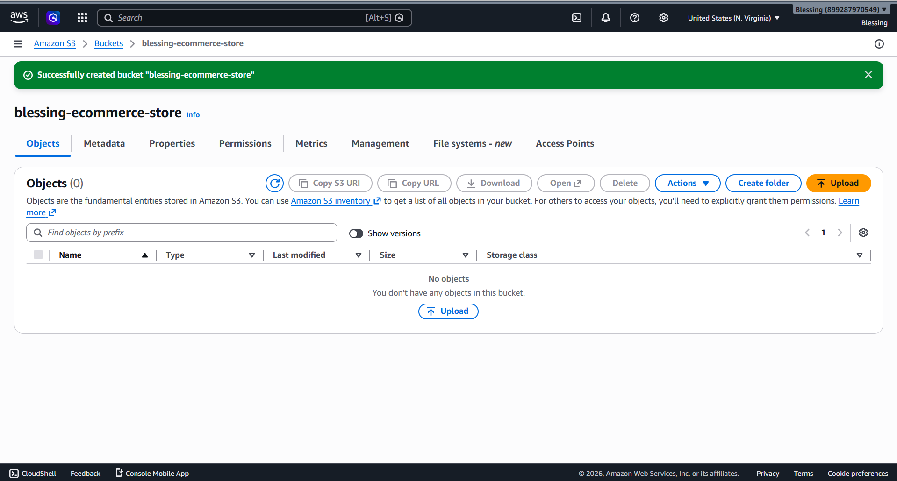

### 03 — Static Website Hosting Enabled
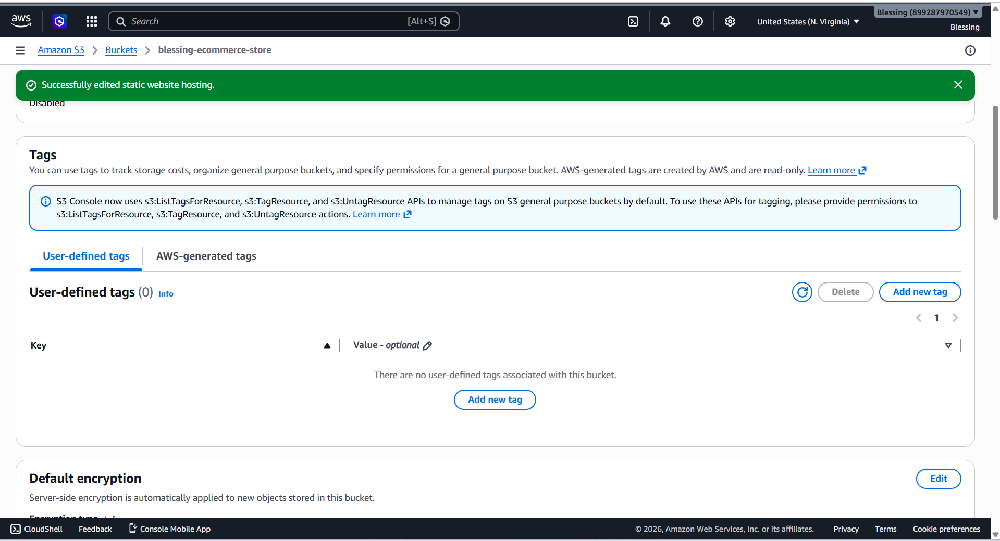

### 04 — Block Public Access Disabled
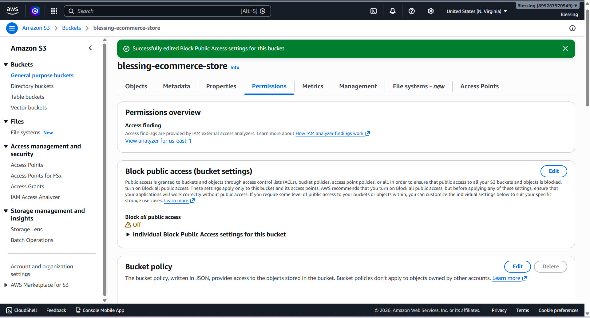

### 05 — Bucket Policy — Public Read
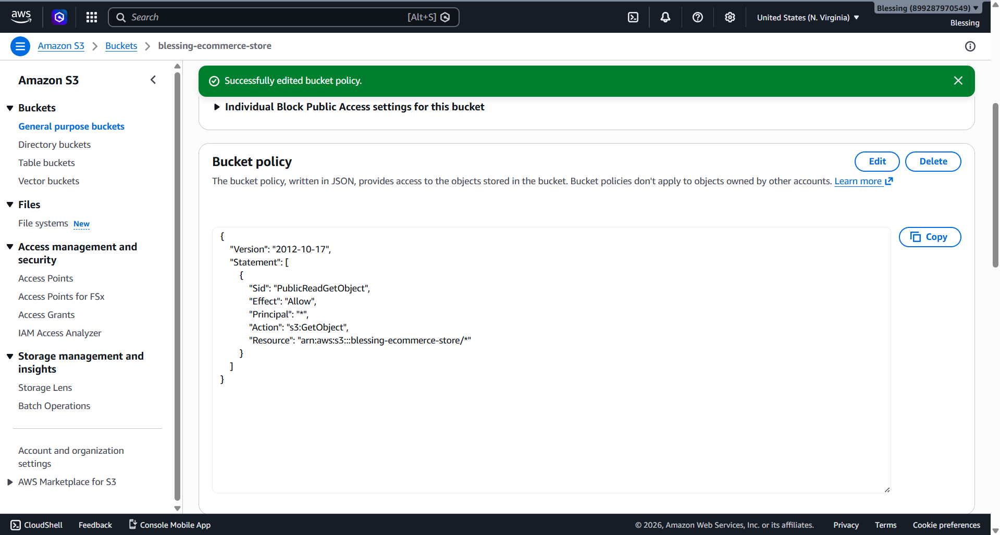

### 06 — EC2 Instance Running
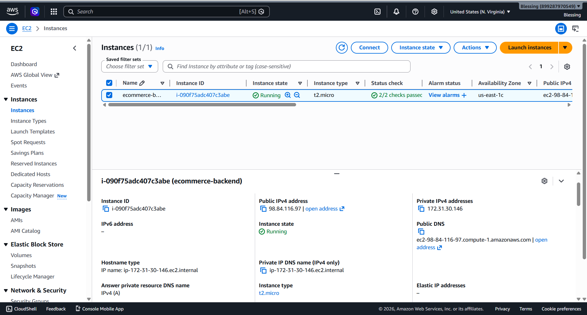

### 07 — EBS Volume Attached (In Use)
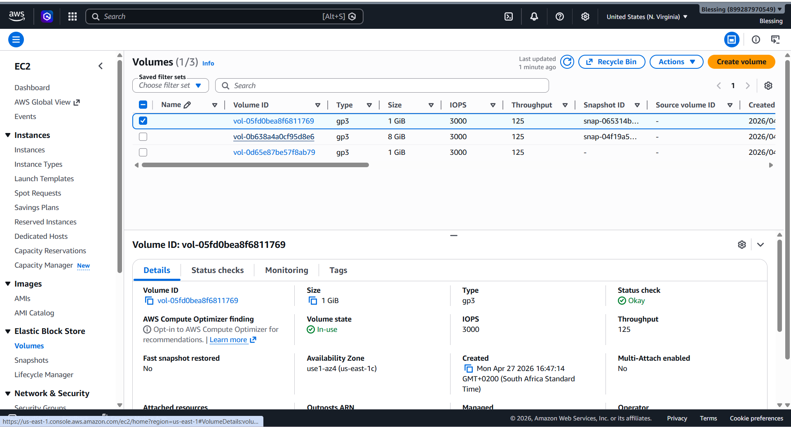

### 08 — EBS Snapshot Completed
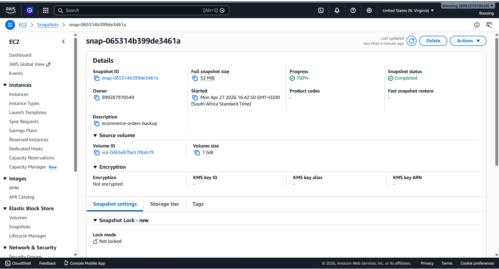

### 09 — AMI Created (ecommerce-backend-ami)
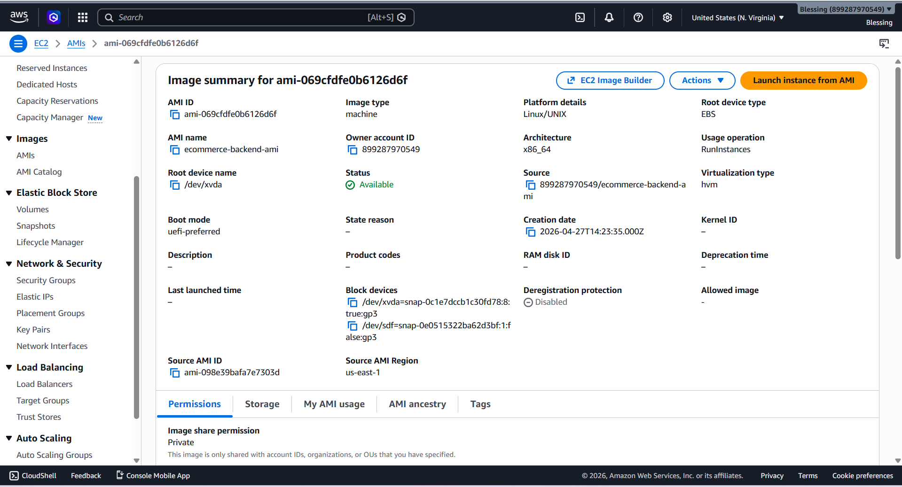

### 10 — SSH Connected & Volume Mounted
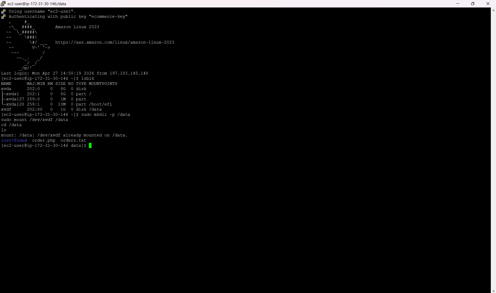

### 11 — Recovery Orders Data Verified
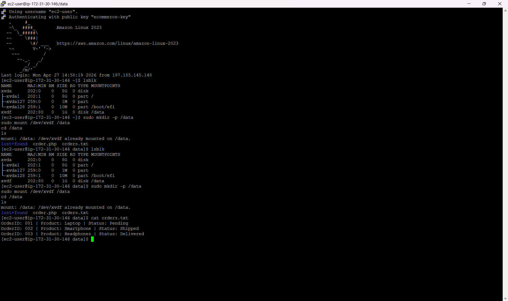

### 12 — Security Group SSH Inbound Rule
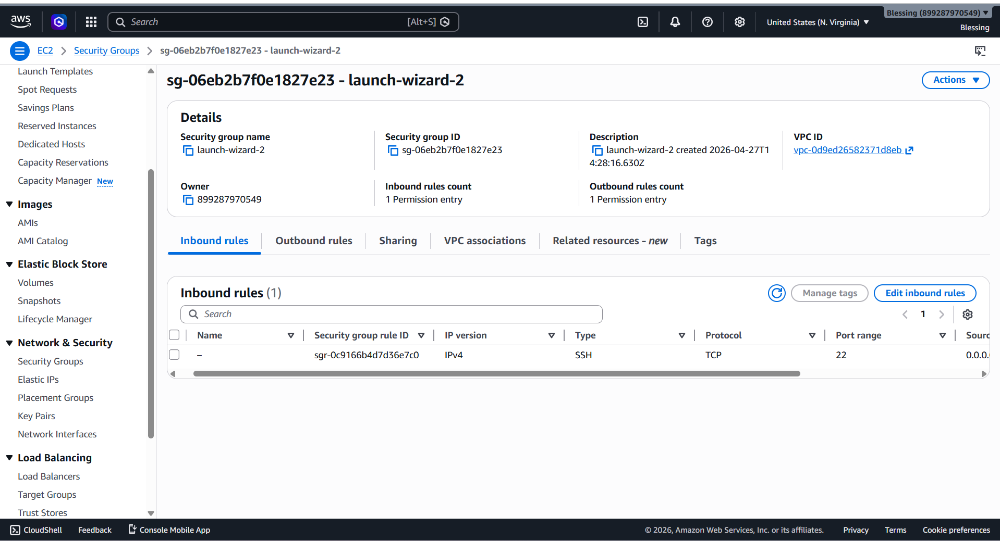

### 13 — Instance Terminated (Cleanup)
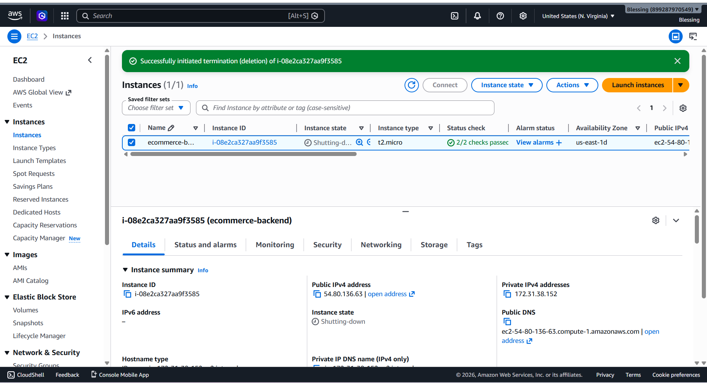
